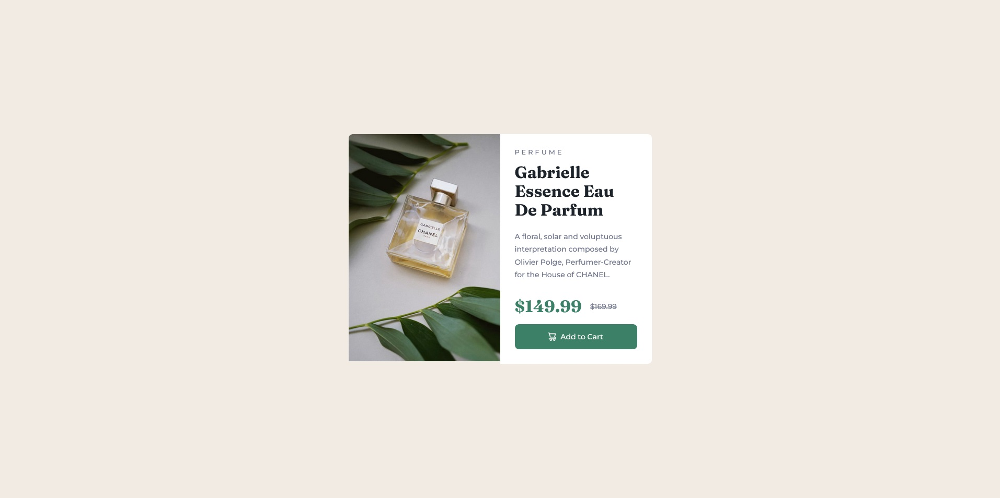
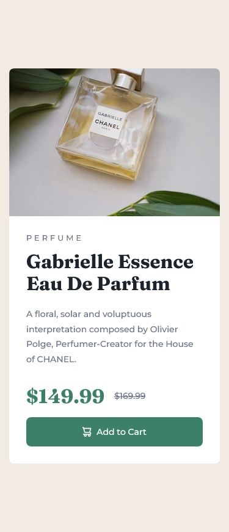

# Frontend Mentor - Product preview card component solution

This is a solution to the [Product preview card component challenge on Frontend Mentor](https://www.frontendmentor.io/challenges/product-preview-card-component-GO7UmttRfa). Frontend Mentor challenges help you improve your coding skills by building realistic projects. 

## Table of contents

- [Overview](#overview)
  - [The challenge](#the-challenge)
  - [Screenshot](#screenshot)
  - [Links](#links)
- [My process](#my-process)
  - [Built with](#built-with)
  - [What I learned](#what-i-learned)
  - [Continued development](#continued-development)
- [Author](#author)

## Overview

### The challenge

Users should be able to:

- View the optimal layout depending on their device's screen size
- See hover and focus states for interactive elements

### Screenshot





### Links

- Solution URL: [https://github.com/GSD3v08/product-preview-card](https://github.com/GSD3v08/product-preview-card)
- Live Site URL: [https://gsd3v08.github.io/product-preview-card](https://gsd3v08.github.io/product-preview-card)

## My process

### Built with

- Semantic HTML5 markup
- CSS custom properties
- Flexbox
- Mobile-first workflow


### What I learned

I learn more about responsive design and how to fix the problem about the white space when a image is in a container.
You have two options:

add to container:
```css
.container {
  line-height: 0;
}
```
or to image:

```css
img {
  display: block;
}
```


### Continued development

keep making projects with flexbox and responsive design.


## Author

- Frontend Mentor - [@GSD3v08](https://www.frontendmentor.io/profile/GSD3v08)


